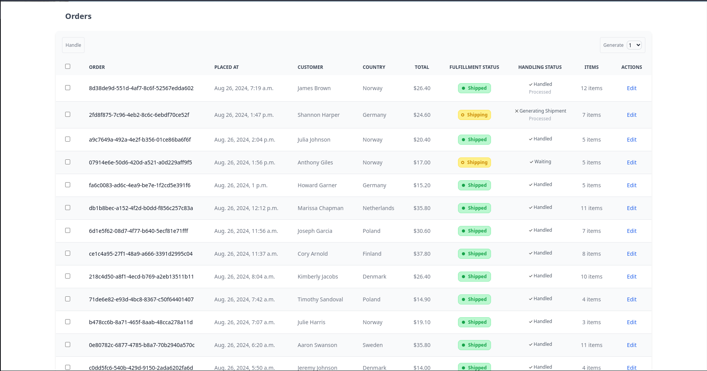

# Order Management System - Task Queue Prototype/Example

### Motivation
Often, an order management system is an application that is integrated with multiple marketplaces, from which pending orders are imported on an interval basis. Once orders are imported, they have to be handled. Handling orders might involve printing packing slips, generating shipments, sending generated tracking numbers back to the marketplace, and marking handled orders as shipped. All of those steps have to be done in a particular sequence. The order management system helps with the entire process by allowing users to select waiting/pending orders and perform handling-order operations in bulk for multiple orders.

In the perfect world, it would be ideal to be able to select all pending orders and, by pressing as few buttons as possible, handle all of them at once. One of the problems that might occur is that the system times out after trying to handle a larger number of orders.

### Research
In general, turning all blocking API calls asynchronous makes handling order processes significantly faster. However, it might introduce other problems. In particular, when an order/sequence of sending requests to the third-party APIs is important.

For example, it might be the case that sending an API request for generating shipments is connected with printing packing labels for those orders (so a single request generates a shipment and prints a packing label for an order). While calling the API synchronously, packing labels are coming out of the printer in the same order as they are visible on the frontend, which mitigates the chances of human error while preparing an actual package. Making the API requests asynchronous results in requests being sent in a random order, which creates extra work for the user who needs to manually sort just printed packing labels.

Using only one worker for handling asynchronous requests completely removes all speed-ups caused by using coroutines and introduces unnecessary complexity to the codebase.

### Solution
A proposed solution to the situation when an order/sequence of sending requests to the third party APIs is important while handling orders is to use a task queue running in a separate process than the current application. This allows to schedule/queue numerous orders which will be handled progressively by a single worker while releasing the main thread of the application and allowing users to continue using the system.

If the sequence of sending requests is not important, the number of workers can be increased for significant performance boost.

### The Prototype/Example
The prototype was built using FastAPI, Django, and Celery, where Celery is used for the heavy lifting related to the task queue.

The frontend is generated by using a Django template HTML file, that is enhanced with the FastAPI endpoints to handle POST actions and display current handling status using server-side events.

All order data is fake and can be generated when needed.

The general flow of handling orders in the prototype is to generate fake orders, select them, and click on the "handle" button. The system will queue and handle orders one-by-one. At each step while handling orders, there is a 5% chance that that step might fail. If that happens, it is possible to click on the handling status cell to see "Handling History" and inspect what and why failed.
